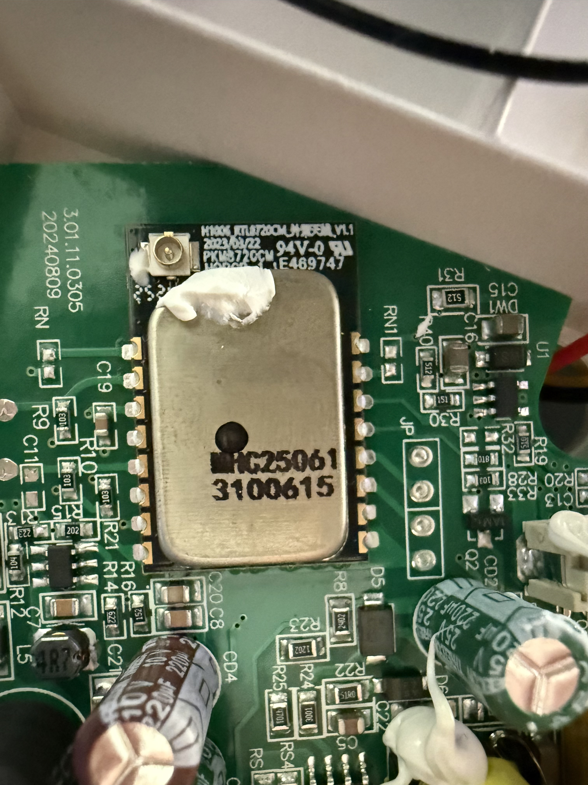
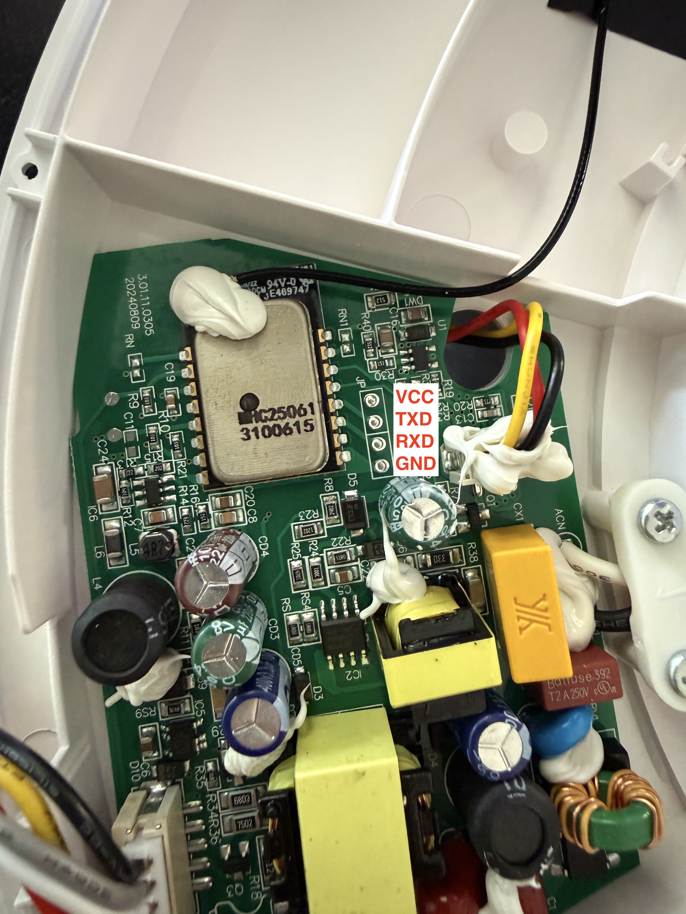
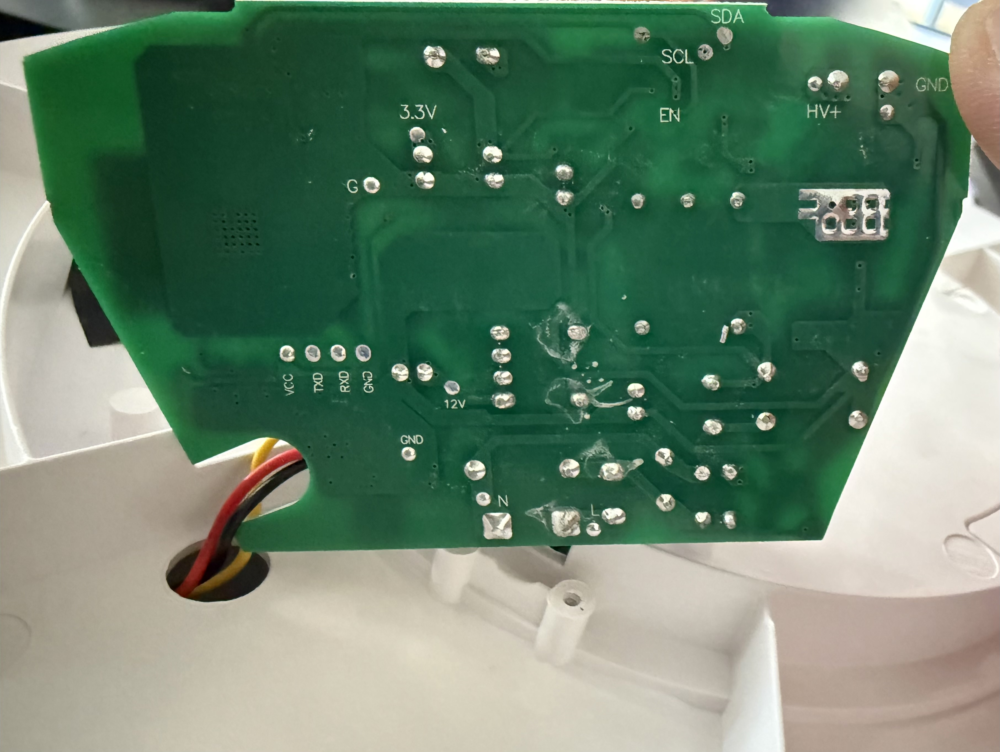
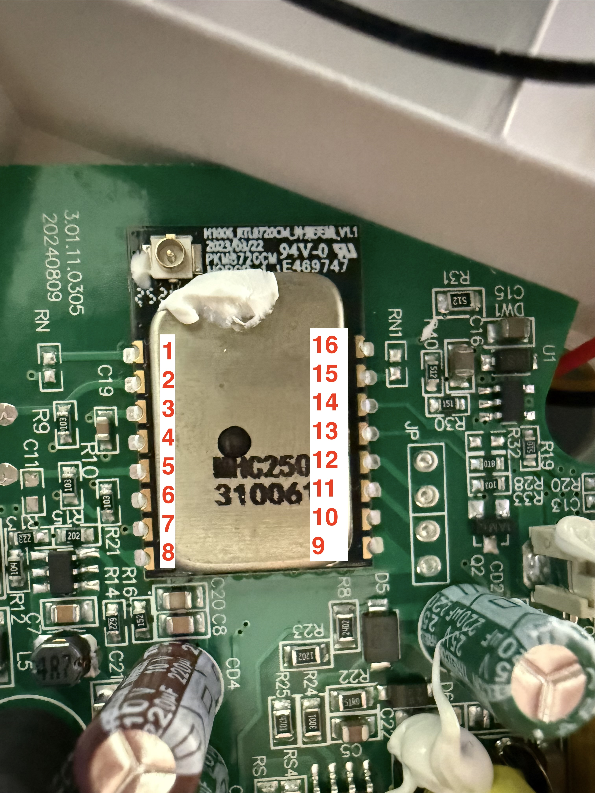

Uses a custom module. CPU is RTL8720CM.


Opening the light is straightforward; simply remove the 12 Phillips head screws around the perimeter of the light,
and carefully flip the top half of the light over. Note: the wires running between the PCB and the main light will
prevent you from removing the back completely.



To flash the module, you'll have to use ltchiptool. I found that I was unable to flash them at
a baud rate other than 115200. I also found making a flash backup took ~30 minutes.

Govee was kind, and exposed all the connections you need to flash the module in a single header (JP):


In addition, you will need to pull PA0 and PA13 to 3.3V to put the MCU in download mode; the full
 pinout of the module is as follows:

## Module Pinout

Without a datasheet for the module, I've arbitrarily assigned Pin 1 to be in the upper left corner
(nearest the antenna connector), with Pin 8 being the lower left corner, and Pin 9 in the lower right.


| Pin Number | GPIO | Function on device                 |
|------------|------|------------------------------------|
| 1          | PA0  | Download Mode -> Pull High         |
| 2          | PA23 | Main Light I2C SCL                 |
| 3          | CEN  | Enable / Reset                     |
| 4          | PA20 | NC                                 |
| 5          | PA2  | Main Light I2C SDA                 |
| 6          | PA3  | NC                                 |
| 7          | PA4  | Power supply enable for main light |
| 8          |      | VCC                                |
| 9          |      | GND                                |
| 10         | PA17 | NC                                 |
| 11         | PA15 | Log RXD                            |
| 12         | PA16 | Log TXD                            |
| 13         | PA18 | Power supply enable for ring light |
| 14         | PA19 | WS2811 Data out (ring light)       |
| 15         | PA13 | Download Mode -> Pull High         |
| 16         | PA14 | NC                                 |

I did not have to use the CEN pin to reboot the module in download mode, instead I was able to
connect Pin 1 and 15 to 3.3V using dupont jumper wires before powering up the module.

## Basic Configuration

As of July 2026, libretiny doesn't have support necessary to use the built-in ESPHome
Addressable lighting components, so I've built a custom component that uses the Realtek
SPI HAL interface directly.

```yaml file=config.yaml
```
